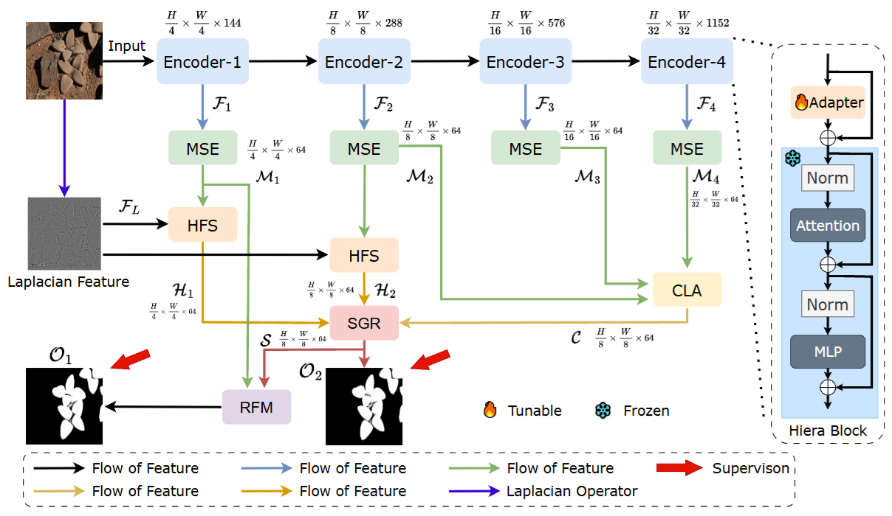

## [IEEE SPL 2025] [HFS-SAM2: Segment Anything Model 2 with High-Frequency Feature Supplementation for Camouflaged Object Detection](https://ieeexplore.ieee.org/document/11081899)
Zihuang Wu, Xinyu Xiong, Guangwei Gao, Hongwei Li, Hua Chen

## Abstract
Camouflaged Object Detection (COD) aims to identify objects seamlessly blended with their backgrounds. While effective solutions exist for camouflaged animals, detecting camouflaged plants presents unique challenges and remains an open problem. This work introduces a novel Plant Camouflage Detection (PCD) method leveraging the Segment Anything Model 2 (SAM2). Our approach enhances the vanilla SAM2 decoder with specialized frequency-aware modules to improve the performance on PCD. Specifically, we employ a laplacian pyramid to extract high-frequency image components and introduce a High-Frequency Supplementation (HFS) module to enhance crucial spatial details for identifying camouflaged plants. The Multi-Scale Extraction (MSE) module is leveraged to capture rich multi-scale information, after which the features from the last three encoder layers are fused through a Cross-Layer Aggregation (CLA) module to obtain the aggregated high-level semantic features. A Semantic Gap Reduction (SGR) module is further proposed to bridge the semantic gap between high-level and shallow features during fusion. Finally, a Reverse Feature Mining (RFM) module is designed to highlight complementary regions and fine details. Extensive experiments on five datasets, encompassing both plant and animal camouflage detection, demonstrate the superior performance of our method compared to state-of-the-art approaches.

## Prediction Maps
Visual results of our model's predictions can be found at [Google Drive](https://drive.google.com/drive/folders/1Z-2QyPIhMusJxc3v9bCShCle90TVjyb8?usp=sharing).
